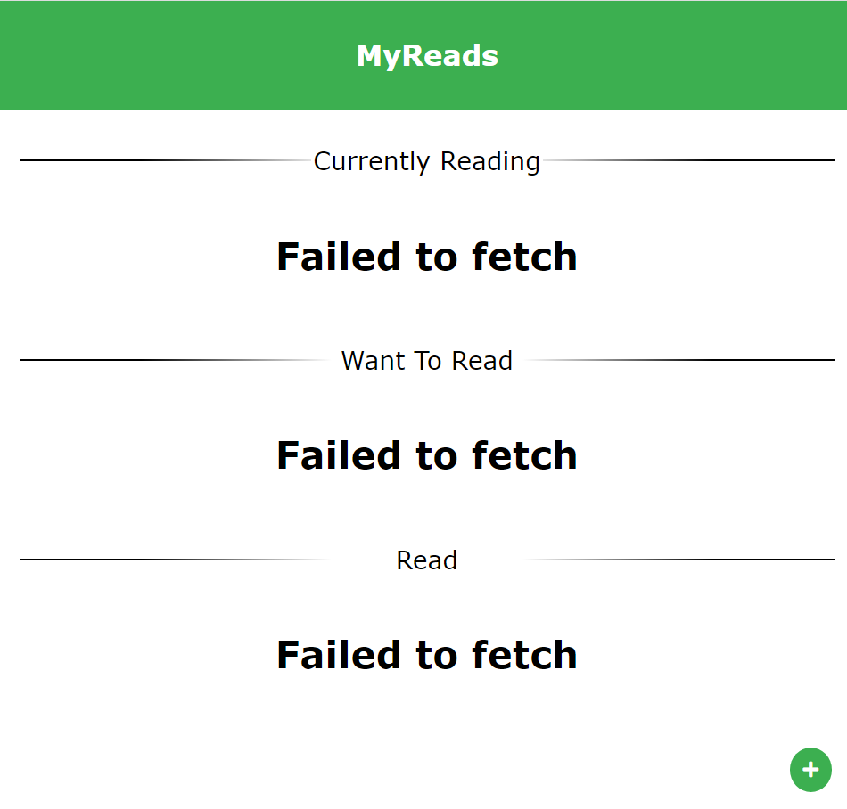
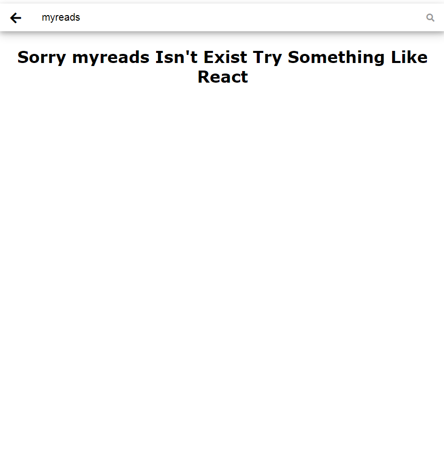
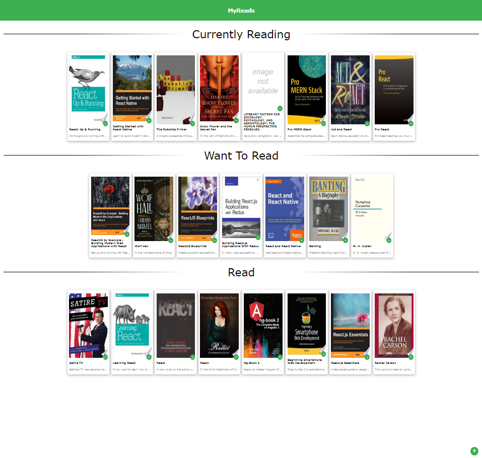
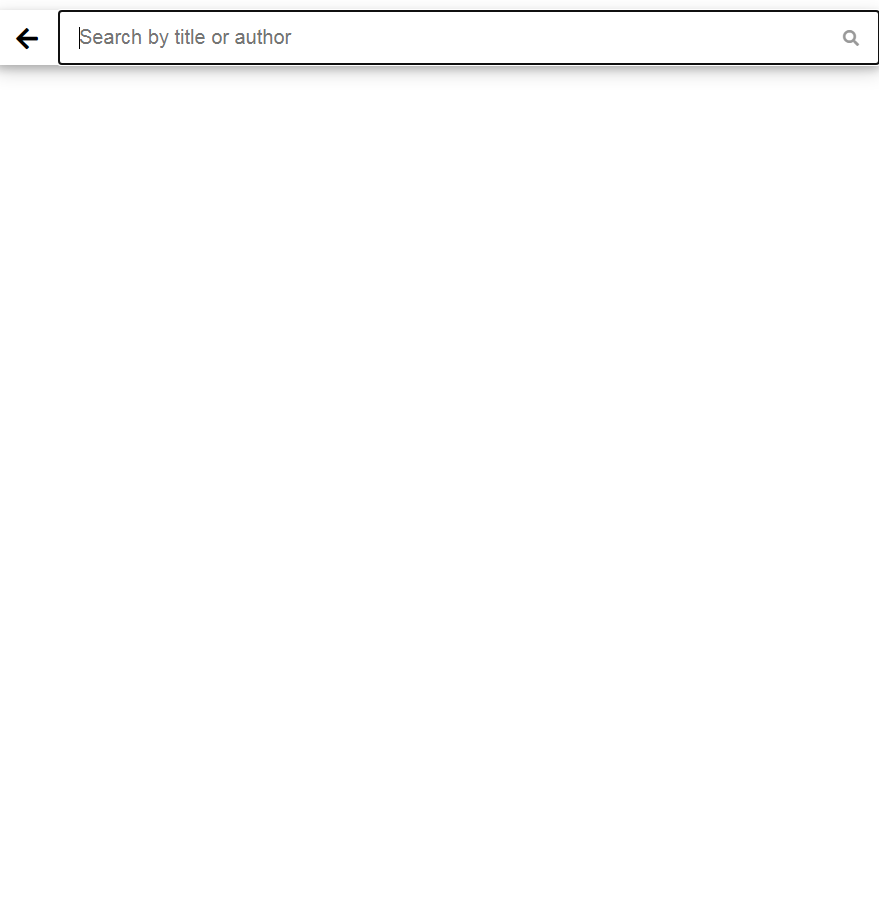
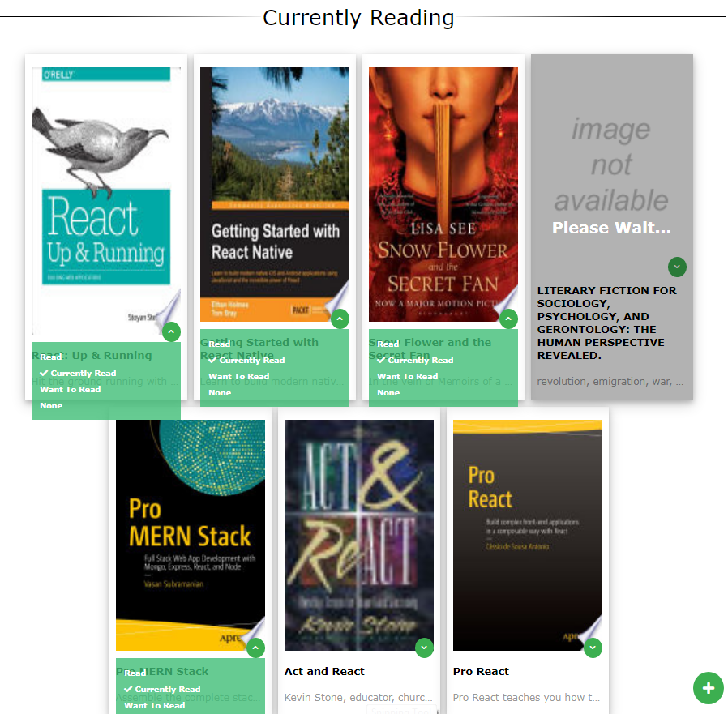

# MyReads Project
MyReads is a book tracking app created for Udacity's React Fundamentals course.
this code created from scratch and bootstraped by [Create React App](https://reactjs.org/docs/create-a-new-react-app.html) You can find more information on how to perform common tasks [here](https://github.com/facebook/create-react-app/blob/main/packages/cra-template/template/README.md).

# Overview

MyReads project creates a bookshelf app that allows you to select and categorize books you have read, currently reading, or want to read

- The application main page displays a list of "shelves" which contains a number of books. The three shelves are:
    * Currently Reading
    * Want to Read
    * Read

- Each book has a control that lets you select the shelf for that book. When you select a different shelf the book moves there, also the default value for the dropdown menu will be changed to the current shelf of the book where it's in.
- the project consist of 2 pages (main page, search page) you can move between the pages to search, select and categorize your desired books 
- you can find the project overview [here](https://youtu.be/HXOaF52t-yI)

## Project requirements:

1. install `git`
2. open cmd and run `git clone https://github.com/MahmoudY3c/nd0191-c1-myreads.git`
3. after cloning open the project folder `cd nd0191-c1-myreads`
4. install all project dependencies with `npm install`
5. start the development server with `npm start`

## Project Structure

```bash
├── README.md.
├── package.json
├── public
│   ├── favicon.ico 
│   └── index.html 
└── src
    ├── components
    │   ├── book-item.js #A component to diplay book item
    │   └── section.js #A component to create a new section
    │── lib
    │   └── font-awesome
    │       └── 5.15.3
    │           │── css
    │           │   └── all.min.css
    │           └── webfonts
    ├── API
    │   ├── BooksAPI # A JavaScript API for the provided Udacity backend for info about usage check https://github.com/udacity/nd0191-c1-myreads#backend-server
    │   └── Methods #A fIle includes all required methods to update, get books from Udacity API by BooksAPI
    ├── Screenshots #some screens for project
    ├── App.css #Page Style
    ├── App.js # Main Page Component
    ├── search.js # Search Page Component.
    └── index.js #includes the app routes
```


## Screenshoots

- While Connection error occure display error message
 
 
 
- While Provided keyword isn't match display Sorry `{userQuery}` isn't exist try something like React
 
 
 
- Main page 
 


 - Search page
 
 

 - While change book shelf display please wait message 
 


# App Functions

1. `BooksAPI.js` you can find usage instructions in Udacity `README` you can access it through [this link](https://github.com/udacity/nd0191-c1-myreads#backend-server)
2. `Methods.js`, `componenets files` you will find some comments that may help you understand how it works 


